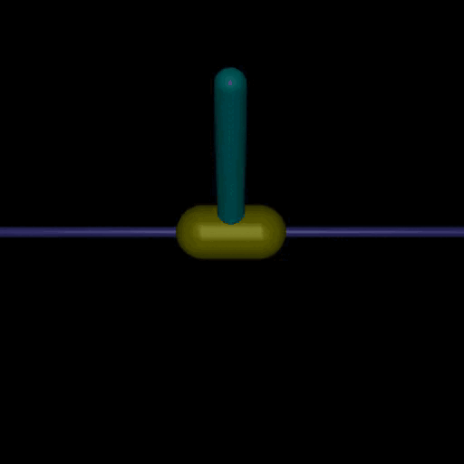
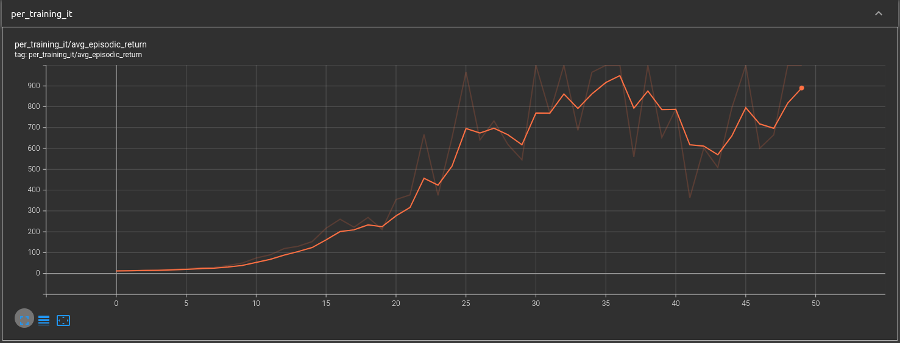
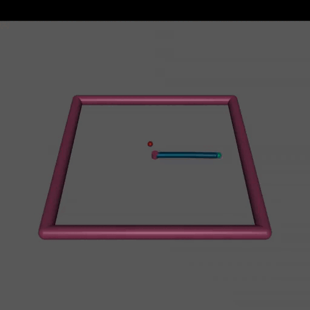
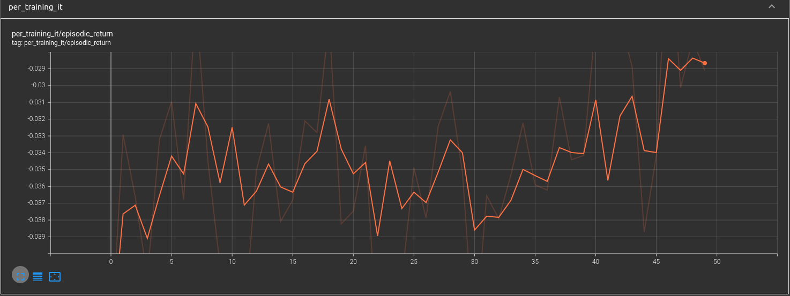

# Proximal Policy Optimization (PPO)

<a href="https://github.com/psf/black"></a>
[](https://colab.research.google.com/github/emasquil/ppo/blob/main/ppo.ipynb)

__This repository provides a working and clean code of the PPO algorithm using [JAX](https://github.com/google/jax) and [Haiku](https://github.com/deepmind/dm-haiku). To see it working, you can simply click on the Colab link above!__

<table style="width:100%; table-layout:fixed;">
	<tr>
		<td></td>
		<td></td>
	</tr>
	<tr>
		<td>Our PPO agent trained on inverted pendulum.</td>
		<td>Average episodic return over the rollouts. More is available by typing "tensorboard --logdir results/inv-pend/".</td>
	</tr>
	<tr>
		<td></td>
		<td></td>
	</tr>
	<tr>
		<td>Our PPO agent trained on reacher.</td>
		<td>Average episodic return over the rollouts. More is available by typing "tensorboard --logdir results/reacher/".</td>
	</tr>
	<tr>
		<td></td>
		<td></td>
	</tr>
	<tr>
		<td>Our PPO agent trained on pendulum.</td>
		<td>Average episodic return over the rollouts. More is available by typing "tensorboard --logdir results/pendulum/".</td>
	</tr>
</table>

Interested readers can have a look to our [report](./report.pdf) that goes deeper into the details.

## Contents
* [Environments](#environments)
* [Agents](#agents)
* [Tricks](#tricks)
* [How to run it](#how-to-run-it)
* [Results](#results)
* [Contributing](#contributing)
* [Inspirations](#inspirations)

---

## Environments
- [InvertedPendulum-v2](https://www.gymlibrary.ml/pages/environments/mujoco/inverted_pendulum)
- [Reacher-v2](https://www.gymlibrary.ml/pages/environments/mujoco/reacher).
- [Pendulum-v1](https://www.gymlibrary.ml/pages/environments/classic_control/pendulum).

## Agents
- [random_agent](ppo/agents/random_agent.py): a random agent..
- [vanilla_ppo](ppo/agents/vanilla_ppo.py): our implementation of PPO.


## Tricks
### Networks
- [x] Separated value and policy networks.
- [x] The standard deviation of the policy can be predicted by the policy network or fixed to a given value. `softplus` activation for making the std always positive.
- [x] Orthogonal initialization of the weights and constant initialization for the biases.
- [x] Activation functions are `tanh`.

### Training
- [x] Linear annealing of the learning rates. Different learning rate for the policy and value networks.
- [x] Learning with minibatches. Normalized advantages at minibatch level.

### Loss
- [x] Using Generalized Advantage Estimation (GAE).
- [x] Clipped ratio  
- [x] Minimum between ratio x GAE and clipped_ratio x GAE
- [x] Clipped gradient norm

### Environment wrappers
- [x] Normalization and clipping of the observation
- [x] Normalization and clipping of the rewards
- [x] Action normalization: the agent can predict actions between $[-1, 1]$, and the wrapper scale them back to the environment action range.
    
## How to run it
The training loop is implemented in the [ppo notebook](ppo.ipynb). It contains instances of the agents tuned for each of the environments. We log the training metrics (losses, actions, rewards, etc) to a Tensorboard file, you can monitor it separately or within the notebook. After training is completed, a video of the agent is generated.

### Fast and easy
Just click on this 
[](https://colab.research.google.com/github/emasquil/ppo/blob/main/ppo.ipynb)

### Run it locally
First you need to clone the repository. For that, you can use the following command line:
```Bash
git clone git@github.com:emasquil/ppo.git
```
Then we recommend using a virtual environment, this can be done by the following:
```Bash
python3 -m venv env
source env/bin/activate
```
Finally, in order to install the package, you can simply run:
```Bash
pip install -e .
```
If you are planning on developing the package you will need to add `[dev]` at the end. This gives:
```Bash
pip install -e .[dev]
```

This package uses MuJoCo environments, please install it by following these [instructions](https://github.com/openai/mujoco-py/).

Note that you might need to install the following.

```
sudo apt-get install -y xvfb ffmpeg freeglut3-dev libosmesa6-dev patchelf libglew-dev
```

After all the installs you should be ready to run the notebook locally.

## Results
In the [results](results) directory you can find some plots, logs, and videos of the agents after being trained on the environments previously mentioned.


## Contributing
Before any pull request, please make sure to format your code using the following:
```Bash
black -l 120 ./
```

## Inspirations

[vwxyzjn/cleanrl](https://github.com/vwxyzjn/cleanrl/blob/master/cleanrl/ppo_continuous_action.py)\
[openai/baselines](https://github.com/openai/baselines/blob/ea25b9e8b234e6ee1bca43083f8f3cf974143998/baselines/ppo2/model.py)\
[DLR-RM/stable-baselines3](https://github.com/DLR-RM/stable-baselines3/tree/master/stable_baselines3/ppo)\
[openai/spinningup](https://github.com/openai/spinningup/blob/master/spinup/algos/tf1/ppo/ppo.py)\
[Costa Huang's blogpost](https://costa.sh/blog-the-32-implementation-details-of-ppo.html)\
[deepmind/acme](https://github.com/deepmind/acme/tree/master/acme/agents/jax/ppo)